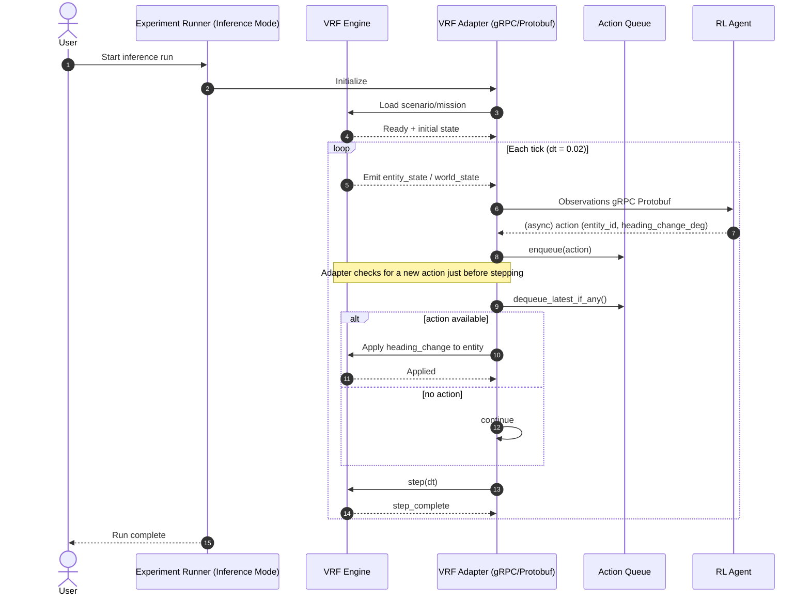

```mermaid
sequenceDiagram
autonumber

actor User
participant Runner as Experiment Runner (Inference Mode)
participant VRFEngine as VRF Engine
participant VRFAdapter as VRF Adapter (gRPC/Protobuf)
participant ActionQueue as Action Queue
participant RLAgent as RL Agent

User->>Runner: Start inference run
Runner->>VRFAdapter: Initialize
VRFAdapter->>VRFEngine: Load scenario/mission
VRFEngine-->>VRFAdapter: Ready + initial state

loop Each tick (dt = 0.02)
  VRFEngine-->>VRFAdapter: Emit entity_state / world_state
  VRFAdapter->>RLAgent: Observations gRPC Protobuf
  RLAgent-->>VRFAdapter: (async) action (entity_id, heading_change_deg)
  VRFAdapter->>ActionQueue: enqueue(action)

  note over VRFAdapter,VRFEngine: Adapter checks for a new action just before stepping
  VRFAdapter->>ActionQueue: dequeue_latest_if_any()
  alt action available
    VRFAdapter->>VRFEngine: Apply heading_change to entity
    VRFEngine-->>VRFAdapter: Applied
  else no action
    VRFAdapter->>VRFAdapter: continue
  end

  VRFAdapter->>VRFEngine: step(dt)
  VRFEngine-->>VRFAdapter: step_complete
end

Runner-->>User: Run complete
```
