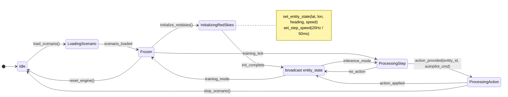
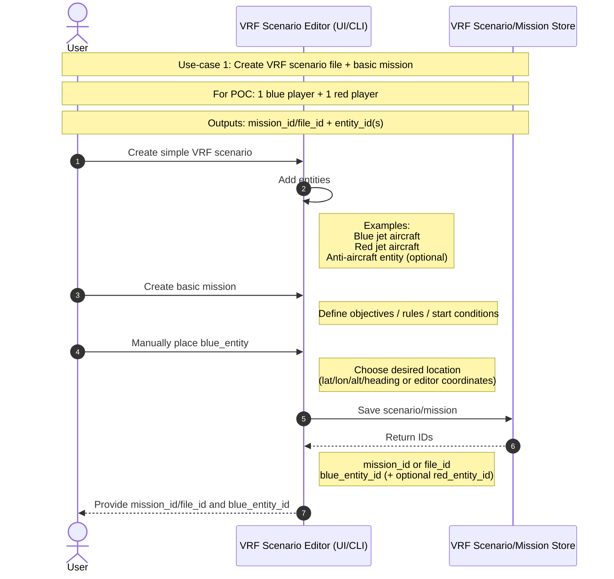
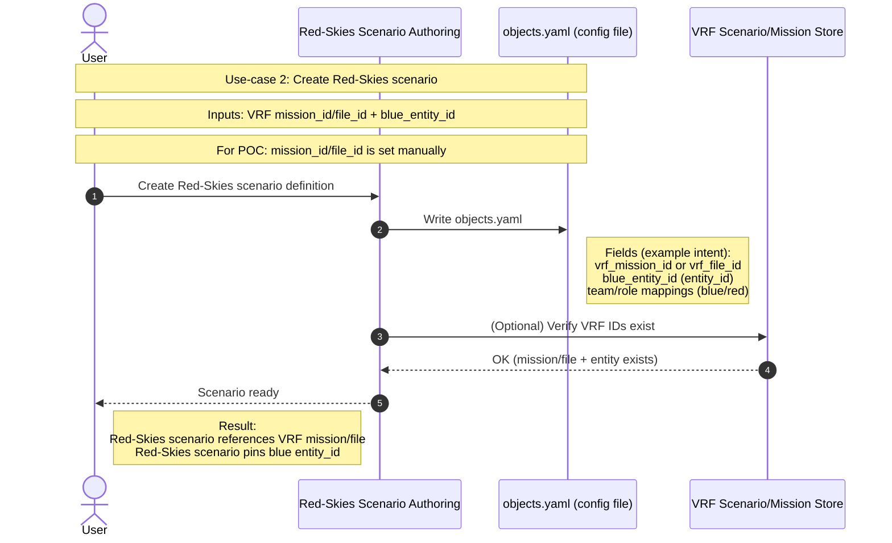
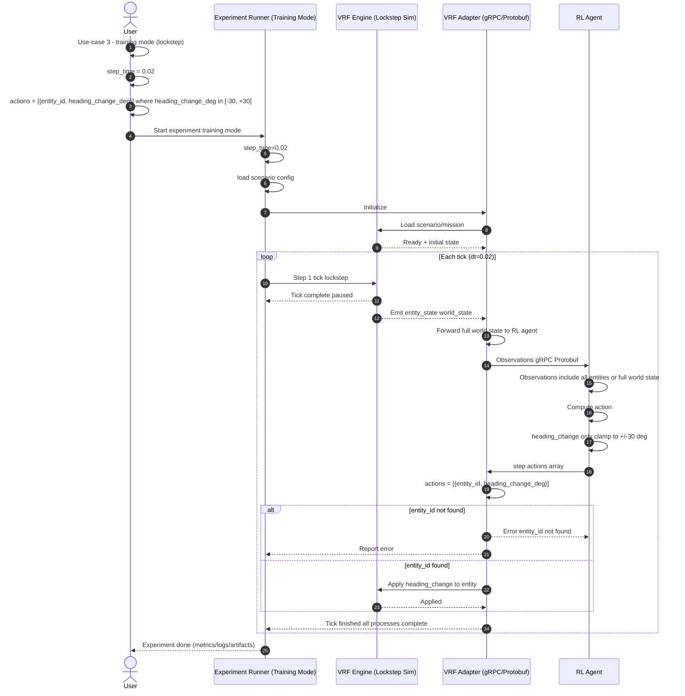
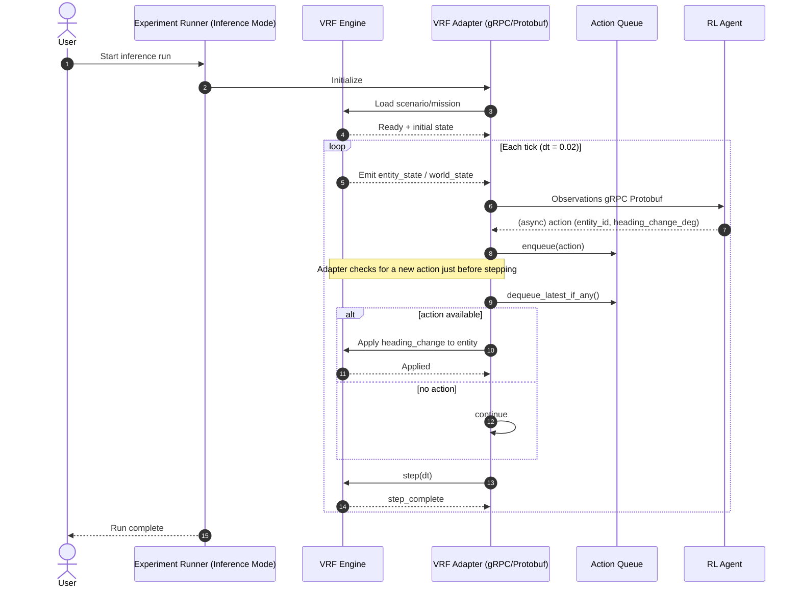

# POC — VRF RL Training

## Charts

- [State Machine](#state-machine)
- [01 — Create VRF Scenario (Sequence)](#01--create-vrf-scenario-sequence)
- [02 — Create Red-Skies Scenario (Sequence)](#02--create-red-skies-scenario-sequence)
- [03 — Training Mode Lockstep (Sequence)](#03--training-mode-lockstep-sequence)
- [04 — Inference Mode Async (Sequence)](#04--inference-mode-async-sequence)

## State Machine

Source: `state_machine.md`

## 01 — Create VRF Scenario (Sequence)

Source: `01_create_vrf_scenario.sequence.md`

## 02 — Create Red-Skies Scenario (Sequence)

Source: `02_create_red_skies_scenario.sequence.md`

## 03 — Training Mode Lockstep (Sequence)

Source: `03_training_mode_lockstep.sequence.md`

## 04 — Inference Mode Async (Sequence)

Source: `04_inference_mode_async.sequence.md`

