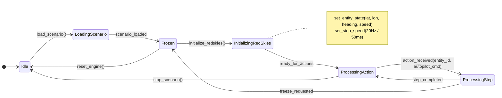

```mermaid
stateDiagram-v2
    direction LR

    [*] --> Idle

    Idle --> LoadingScenario : load_scenario()
    LoadingScenario --> Frozen : scenario_loaded

    Frozen --> InitializingRedSkies : initialize_redskies()
    note right of InitializingRedSkies
        set_entity_state(lat, lon, heading, speed)
        set_step_speed(20Hz / 50ms)
    end note

    InitializingRedSkies --> ProcessingAction : ready_for_actions

    ProcessingAction --> ProcessingStep : action_received(entity_id, autopilot_cmd)

    ProcessingStep --> ProcessingAction : step_completed
    ProcessingStep --> Frozen : freeze_requested

    Frozen --> Idle : reset_engine()

    ProcessingAction --> Idle : stop_scenario()
```