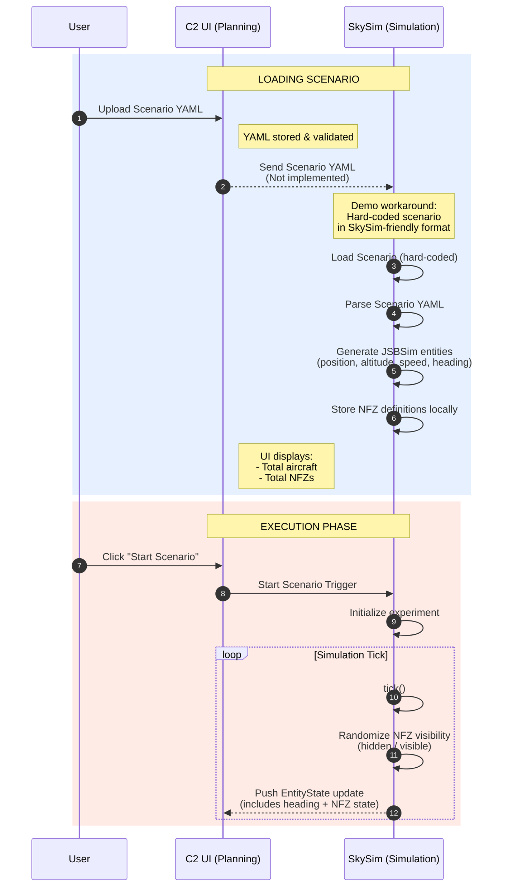

```mermaid
sequenceDiagram
    autonumber

    participant User
    participant C2 as C2 UI (Planning)
    participant SkySim as SkySim (Simulation)

    %% --- LOADING SCENARIO ---
    rect rgb(230, 240, 255)
        Note over C2,SkySim: LOADING SCENARIO

        User->>C2: Upload Scenario YAML
        Note right of C2: YAML stored & validated

        C2-->>SkySim: Send Scenario YAML<br/>(Not implemented)
        Note over SkySim: Demo workaround:<br/>Hard-coded scenario<br/>in SkySim-friendly format

        SkySim->>SkySim: Load Scenario (hard-coded)
        SkySim->>SkySim: Parse Scenario YAML
        SkySim->>SkySim: Generate JSBSim entities<br/>(position, altitude, speed, heading)
        SkySim->>SkySim: Store NFZ definitions locally

        Note right of C2: UI displays:<br/>- Total aircraft<br/>- Total NFZs
    end

    %% --- EXECUTION PHASE ---
    rect rgb(255, 235, 230)
        Note over C2,SkySim: EXECUTION PHASE

        User->>C2: Click "Start Scenario"
        C2->>SkySim: Start Scenario Trigger

        SkySim->>SkySim: Initialize experiment
        loop Simulation Tick
            SkySim->>SkySim: tick()
            SkySim->>SkySim: Randomize NFZ visibility<br/>(hidden / visible)
            SkySim-->>C2: Push EntityState update<br/>(includes heading + NFZ state)
        end
    end
```