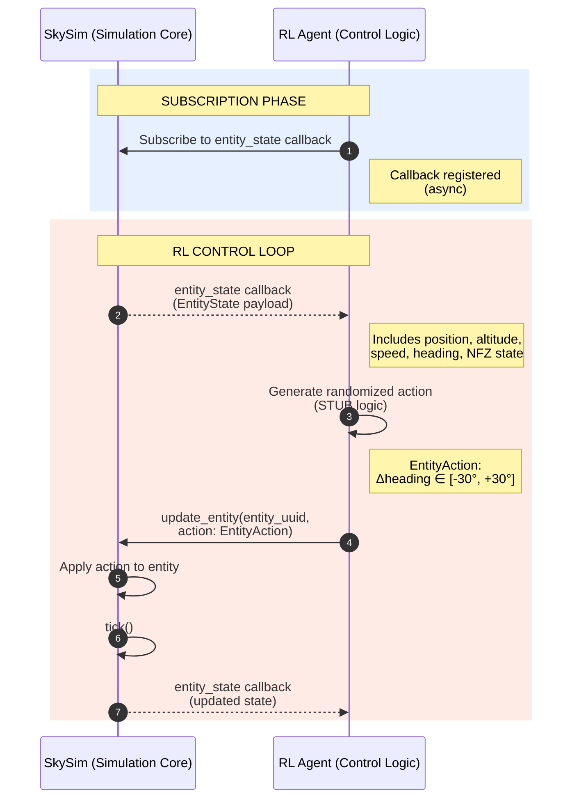

```mermaid
sequenceDiagram
    autonumber

    participant SkySim as SkySim (Simulation Core)
    participant RL as RL Agent (Control Logic)

    %% --- SUBSCRIPTION PHASE ---
    rect rgb(230, 240, 255)
        Note over RL,SkySim: SUBSCRIPTION PHASE

        RL->>SkySim: Subscribe to entity_state callback
        Note right of RL: Callback registered<br/>(async)
    end

    %% --- CONTROL LOOP ---
    rect rgb(255, 235, 230)
        Note over RL,SkySim: RL CONTROL LOOP

        SkySim-->>RL: entity_state callback<br/>(EntityState payload)
        Note right of RL: Includes position, altitude,<br/>speed, heading, NFZ state

        RL->>RL: Generate randomized action<br/>(STUB logic)
        Note right of RL: EntityAction:<br/>Δheading ∈ [-30°, +30°]

        RL->>SkySim: update_entity(entity_uuid,<br/>action: EntityAction)

        SkySim->>SkySim: Apply action to entity
        SkySim->>SkySim: tick()
        SkySim-->>RL: entity_state callback<br/>(updated state)
    end
```