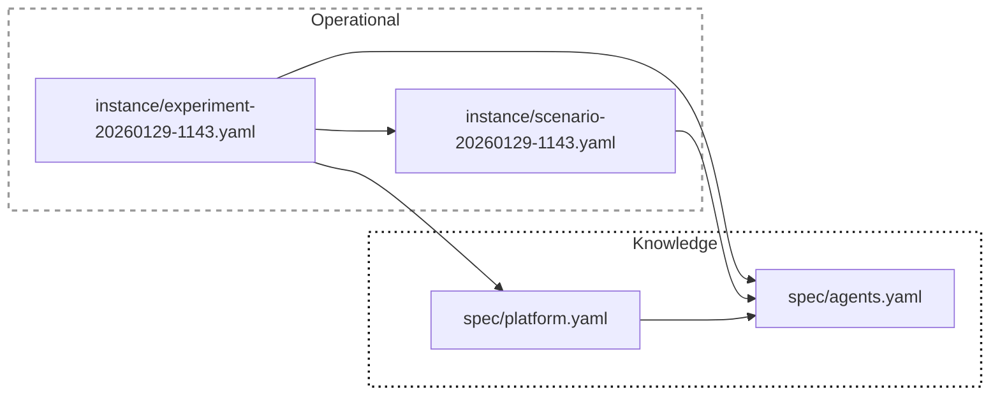
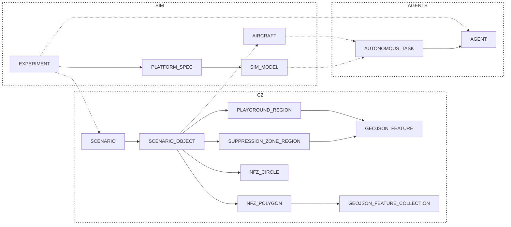
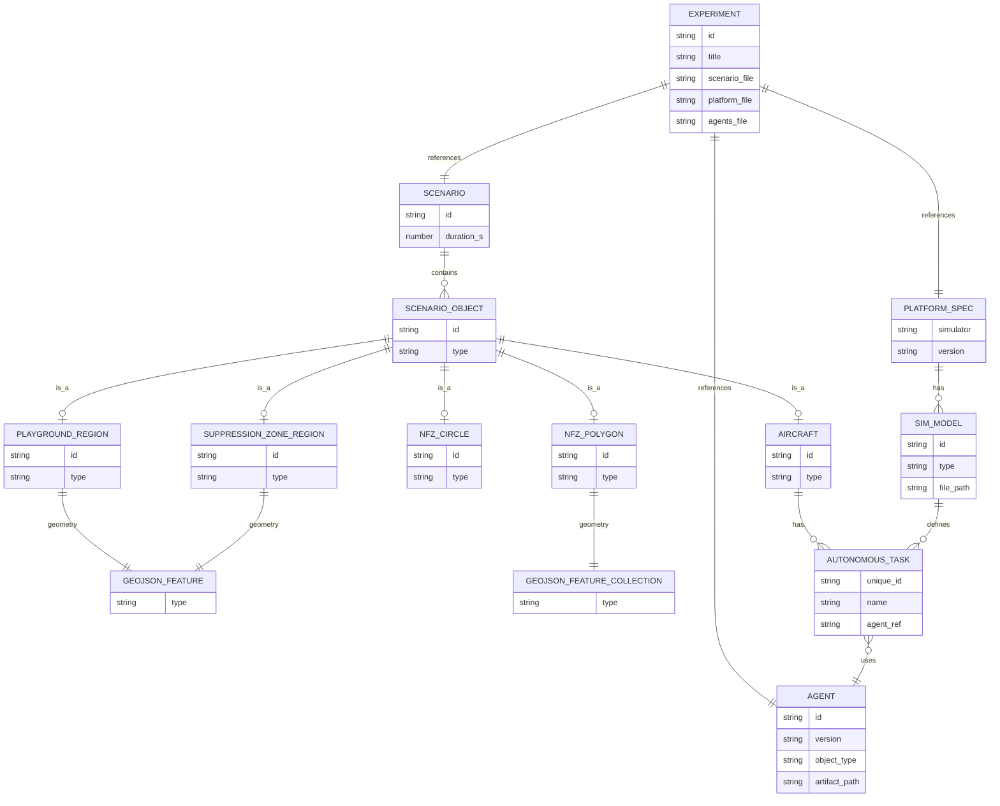

# config-v2

This folder contains a split between **specification** (reusable definitions) and **instance** (a concrete runnable configuration).

## Layout

### `spec/`
Reusable, versioned-ish definitions that can be referenced by many experiments:

- `spec/platform.yaml`
  - Defines available `simulators` (e.g. `jsbsim`, `vrforces`)
  - Defines simulator `models` (e.g. `c310`, `c172`, `f16`)
  - Defines model-level `autonomous_tasks` and which `agent_ref` should execute each task

- `spec/agents.yaml`
  - Defines `agents[]` (policy artifacts + training/inference metadata)
  - Agents are referenced by ID via `agent_ref` from both platform tasks and scenario tasks

### `instance/`
Concrete, dated configurations you actually run:

- `instance/scenario-<dt>.yaml`
  - Contains `scenario` metadata
  - Embeds `scenario.objects[]` (regions, aircraft, NFZs, etc.)
  - Aircraft can declare `autonomous_tasks[]` with `agent_ref` pointing to `spec/agents.yaml`

- `instance/experiment-<dt>.yaml`
  - Wires together:
    - The specific scenario instance file
    - `spec/platform.yaml`
    - `spec/agents.yaml`

## Knowledge vs Operational (Spec -> Instance)

## ERD Grouped View (C2 / SIM / AGENTS)

## Diagram Guide

### Knowledge vs Operational

**Knowledge** is the reusable configuration ("what exists"):

- **`spec/platform.yaml`**
  - Defines the simulator capabilities and models (what can be simulated)
  - Declares model-level tasks and how they should be executed
- **`spec/agents.yaml`**
  - Defines the available agent implementations (artifacts + metadata)

**Operational** is a concrete run configuration ("what will run now"):

- **`instance/scenario-<dt>.yaml`**
  - One scenario instance containing `scenario` + embedded `scenario.objects[]`
- **`instance/experiment-<dt>.yaml`**
  - One experiment instance that wires a scenario instance to the spec files

The key idea is that **operational** files select and compose **knowledge**:

- Scenario tasks reference agents by ID via `agent_ref`
- Platform model tasks also reference agents via `agent_ref`

### ERD Grouped View (C2 / SIM / AGENTS)

The grouped view is a readability layer on top of the ERD that clusters entities into functional blocks.

#### C2

- **SCENARIO**: Scenario metadata and the root container for `scenario.objects[]`.
- **SCENARIO_OBJECT**: A typed object entry in the scenario (aircraft, regions, NFZs).
- **PLAYGROUND_REGION**: The allowed operating area, represented as a GeoJSON polygon feature.
- **SUPPRESSION_ZONE_REGION**: The target region relevant for fire suppression tasks.
- **NFZ_CIRCLE**: Circular no-fly zone definition (center + radius).
- **NFZ_POLYGON**: Polygonal no-fly zone definition (GeoJSON FeatureCollection).
- **GEOJSON_FEATURE**: GeoJSON Feature used for region geometry and centroids.
- **GEOJSON_FEATURE_COLLECTION**: GeoJSON FeatureCollection used for polygonal geometries.

#### SIM

- **EXPERIMENT**: The top-level wiring document connecting scenario, platform, and agents.
- **PLATFORM_SPEC**: Simulator/platform definitions (simulators, models, and their capabilities).
- **SIM_MODEL**: A concrete simulator model (e.g. aircraft model) with supported autonomous tasks.
- **AIRCRAFT**: A scenario aircraft entity with initial state and assigned autonomous tasks.

#### AGENTS

- **AGENT**: An executable policy/agent artifact plus metadata (versioning, training/inference info).
- **AUTONOMOUS_TASK**: A task definition that references an agent via `agent_ref`.

## ERD (detailed relationships)

